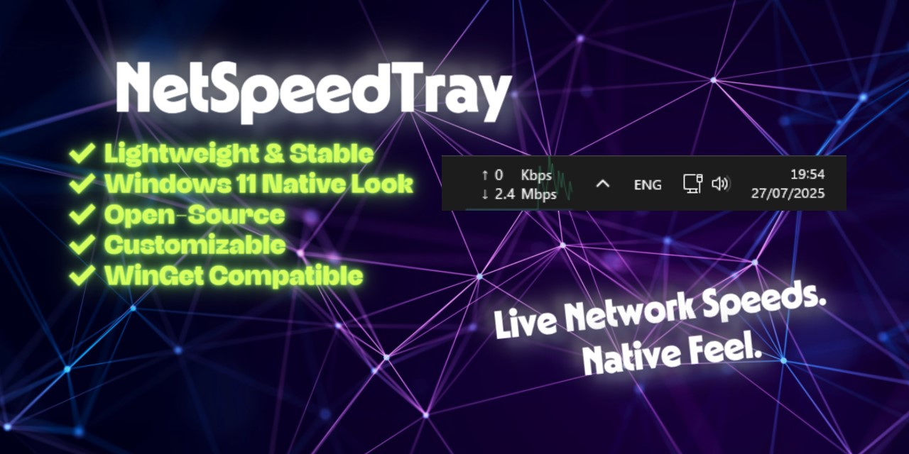
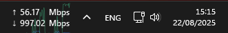
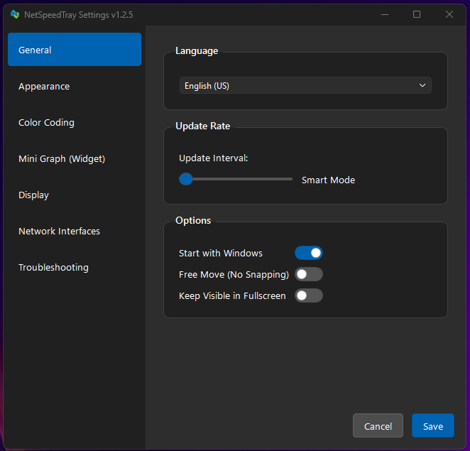

# NetSpeedTray

  [](https://github.com/microsoft/winget-pkgs)    



A lightweight, open-source system monitor for Windows that displays live network speeds, CPU/GPU utilization, temperatures, and power draw directly on the Taskbar. It's the feature Windows forgot.

---

## Installation

The easiest way to install and get automatic updates is with a package manager.

**Using [Winget](https://docs.microsoft.com/en-us/windows/package-manager/winget/) (Recommended, built into Windows):**

```powershell
winget install --id erez-c137.NetSpeedTray
```

### Manual Download
Download the latest files directly from the [**Releases Page**](https://github.com/erez-c137/NetSpeedTray/releases/latest).

-   **`NetSpeedTray-x.x.x-Setup.exe`:** The standard Windows installer. Recommended for most users.
-   **`NetSpeedTray-x.x.x-Portable.zip`:** The portable version. No installation needed — just extract and run `NetSpeedTray.exe`.

---

## Key Features

### Network Monitoring

-   **Live Upload/Download Speeds** on the taskbar with sub-second updates
-   **Auto-Primary Mode:** Intelligently identifies your main internet connection, ignoring noise from VPNs and virtual adapters
-   **Interface Filtering:** Monitor all hardware, specific adapters, or include virtual interfaces
-   **Color Coding:** Set custom speed thresholds and colors to visualize network load at a glance
-   **App Activity Window:** See estimated per-app network usage (with a non-admin fallback mode)

### Hardware Monitoring

-   **CPU & GPU Utilization** displayed alongside network speeds on the taskbar
-   **Temperature Readouts** for CPU and GPU (via [LibreHardwareMonitor](https://github.com/LibreHardwareMonitor/LibreHardwareMonitor), nvidia-smi, or Windows PDH/ACPI)
-   **Power Draw** in Watts for CPU (Intel RAPL) and GPU (nvidia-smi / LHM)
-   **RAM & VRAM** usage readouts
-   **Vendor-Agnostic GPU Support** via Windows Performance Counters (PDH) — works with NVIDIA, AMD, and Intel GPUs
-   **LibreHardwareMonitor Auto-Detection:** If LHM/OHM is running, NetSpeedTray picks it up automatically for temperature and power readings across all GPU vendors

> **Tip:** CPU and GPU temperatures require a kernel-level driver. Install [LibreHardwareMonitor](https://github.com/LibreHardwareMonitor/LibreHardwareMonitor) and run it as Administrator — NetSpeedTray detects it automatically. NVIDIA GPU temps also work natively via `nvidia-smi`.

### Widget Layout Modes

-   **Side-by-Side:** Network and hardware stats displayed together
-   **Stacked:** CPU + GPU in a compact column
-   **Auto-Cycle:** Rotates through Network, CPU, and GPU views
-   **Per-Segment Ordering:** Choose the display order (Network / CPU / GPU / None)

### History & Graphs

-   **Dual-Axis Area Charts** for download and upload with split view
-   **CPU & GPU History Tabs** with dedicated graphs
-   **Overview Tab** with synchronized Network/CPU/GPU charts and at-a-glance stats
-   **Symlog Scaling:** Dynamic logarithmic scale shows fine detail in idle traffic and handles Gigabit spikes
-   **Time-Dynamic Rendering:** Detailed line plots for recent data, "Mean & Range" aggregation for long-term history
-   **Data Export:** Export to `.csv` or save high-resolution `.png` snapshots
-   **3-Tier Data Retention:** Raw (24h) → Minute (30d) → Hourly (configurable) for both network and hardware stats

### Performance

-   **NumPy Vectorization** for near-instant graph rendering with years of data
-   **Dynamic Update Rate:** Reduces polling when idle to save CPU and battery
-   **Global Debouncing:** Intelligent input debouncing prevents UI thread freezes
-   **RDP Session Detection:** Automatically detects Remote Desktop sessions, skipping GPU polling and adjusting App Activity to avoid performance issues in virtualized environments

### Visual Customization

-   **Auto-Theme Detection:** Switches text and background colors for Light, Dark, or Mixed taskbar themes
-   **Fluent Design:** Modern Windows 10/11-style controls and flat card styling
-   **Free Move Mode:** Place the widget anywhere — another monitor, the desktop, a specific taskbar spot
-   **Mini-Graph Overlay:** Real-time area chart on the widget with adjustable opacity and gradient fills
-   **Arrow Styling:** Independent font, size, and weight for arrow symbols
-   **Font & Precision Control:** Custom fonts, 0-2 decimal places, fixed-width values to prevent layout jitter
-   **Text Alignment & Units:** Bits (Mbps), Bytes (MB/s), Binary (MiB/s), or Decimal units with toggleable suffixes

### Positioning & Integration

-   **Auto-Shift:** Finds empty space near the system tray and adjusts for new icons
-   **Z-Order Management:** Stays above the taskbar, hides for fullscreen apps and system menus, reappears instantly
-   **Tray Offset Control:** Fine-tune position relative to the system tray
-   **Vertical Taskbar Support:** Automatically adapts layout for side-mounted taskbars
-   **High-DPI Aware:** Proper scaling on 4K and multi-monitor setups

### Localization

-   Full support for **9 languages:** English, Korean, French, German, Russian, Spanish, Dutch, Polish, and Slovenian
-   100% key parity across all locales — no missing translations

### Security & Privacy

-   **Digitally Signed** by [SignPath Foundation](https://signpath.org/) — no SmartScreen warnings
-   **100% Open Source** — no ads, no tracking, no telemetry. [Privacy Policy](privacy.md)
-   **Code Signing** provided by [SignPath.io](https://signpath.io/)

---

## Usage & Screenshots

#### The Widget

The core of NetSpeedTray. It sits on your taskbar showing live speeds and hardware stats.

-   **Right-click** to access Settings, Graph, App Activity, or Exit.
-   **Double-click** to open the full history graph.
-   **Left-click and drag** to adjust position along the taskbar.

<!-- TODO: Replace with v1.3.x screenshot showing side-by-side mode with CPU/GPU -->
<div align="center">
  <br/>
</div>

#### Modern Settings

A clean, 6-page settings UI with collapsible hardware sections, Windows 11 flat card styling, and full control over every aspect of the widget.

<!-- TODO: Replace with v1.3.x screenshot showing hardware settings page -->
<div align="center">
  <br/>
</div>

#### History Graph

Double-click the widget to see detailed, filterable graphs of your network, CPU, and GPU history.

<!-- TODO: Replace with v1.3.x screenshot showing Overview tab with CPU/GPU -->
<div align="center">
  <br/>
</div>

<!-- TODO: Add App Activity window screenshot -->

---

## Support This Project

NetSpeedTray is a labor of love — hundreds of hours of development and debugging to build the feature Windows should have had built-in. It will **always be free, open-source, and ad-free.**

If you get daily value from this widget, please consider supporting its development. Every contribution directly funds new features and long-term maintenance.

<p align="center">
  <a href="https://github.com/sponsors/erez-c137">
    
  </a>
   
  <a href="https://ko-fi.com/erezc137">
    
  </a>
   
  <a href="https://buymeacoffee.com/erez.c137">
    
  </a>
</p>

Can't contribute financially? **Starring the repo** on GitHub is a free and hugely appreciated way to show your support.

---

## Building from Source

<details>
<summary>Click to expand</summary>

### Prerequisites

-   [Python 3.11+](https://www.python.org/downloads/)
-   [Git](https://git-scm.com/downloads/)
-   (Optional) [Inno Setup 6](https://jrsoftware.org/isinfo.php) for building the Windows installer.

### Development & Build Instructions

1.  **Clone the Repository:**

    ```bash
    git clone https://github.com/erez-c137/NetSpeedTray.git
    cd NetSpeedTray
    ```

2.  **Create and Activate a Virtual Environment:**

    ```powershell
    # PowerShell (Recommended on Windows)
    python -m venv .venv
    .\.venv\Scripts\Activate.ps1
    ```

    ```bash
    # CMD
    python -m venv .venv
    .\.venv\Scripts\activate.bat
    ```

3.  **Install All Dependencies:**

    ```bash
    pip install -r dev-requirements.txt
    ```

    > **Note for Python 3.13+ Users:** If you are using a pre-release version of Python (e.g., 3.14), you may need to install dependencies with the `--pre` flag if stable wheels are not yet available:
    > `pip install --pre -r dev-requirements.txt`

4.  **Run the Application from Source:**

    ```bash
    python src/monitor.py
    ```

5.  **Run the Test Suite (Optional):**

    ```bash
    pytest -v
    ```

6.  **Build the Executable and Installer (Optional):**
    -   **Full Package:** To build both the executable and the Inno Setup installer:
        ```bash
        .\build\build.bat
        ```
    -   **Executable Only:** To build just the standalone executable (no installer):
        ```bash
        .\build\build-exe-only.bat
        ```
    -   The final files will be created in the `dist` folder.

</details>

## Contributing

Contributions, issues, and feature requests are welcome! Please feel free to open an issue or submit a pull request.

> **A Note on System UI Integration:** NetSpeedTray is designed to integrate seamlessly with core Windows UI. Elements like the Start Menu and Action Center will always appear on top. The widget gracefully hides when these menus are active and **reappears instantly** when they close. This is intentional — it ensures the widget feels like a polished, non-intrusive part of the operating system.

## License

This project is licensed under the [GNU GPL v3.0](LICENSE).
